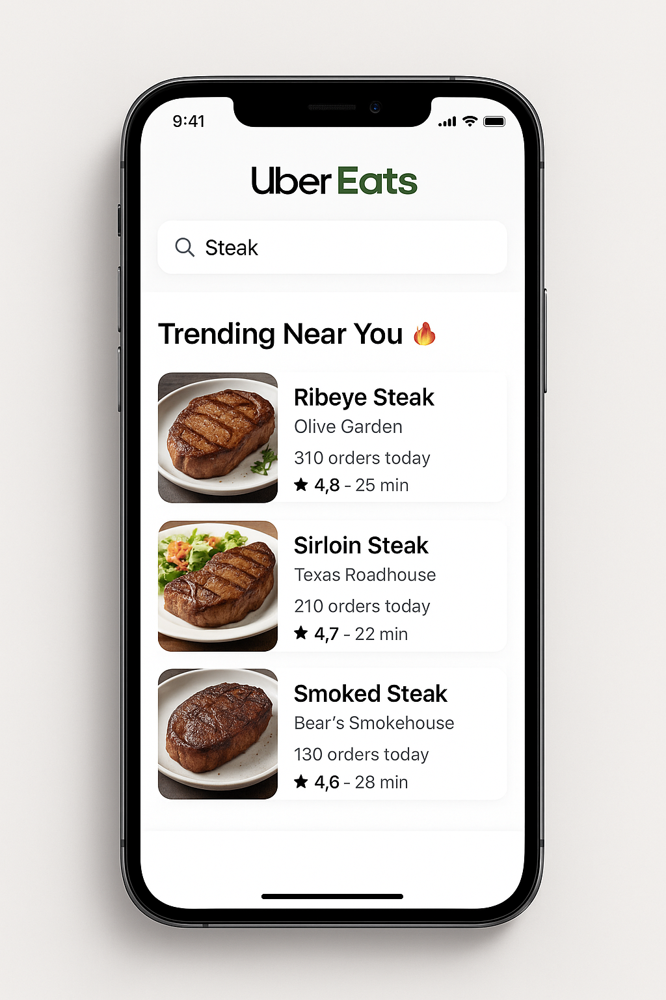
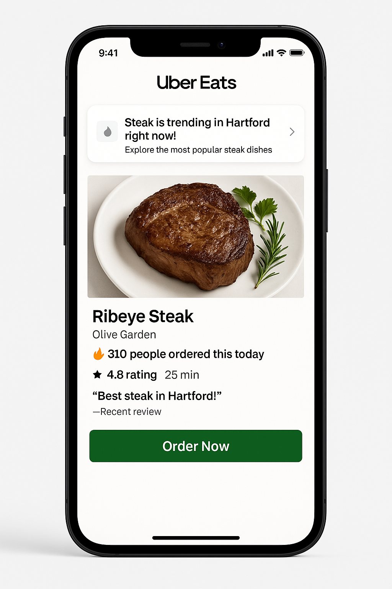
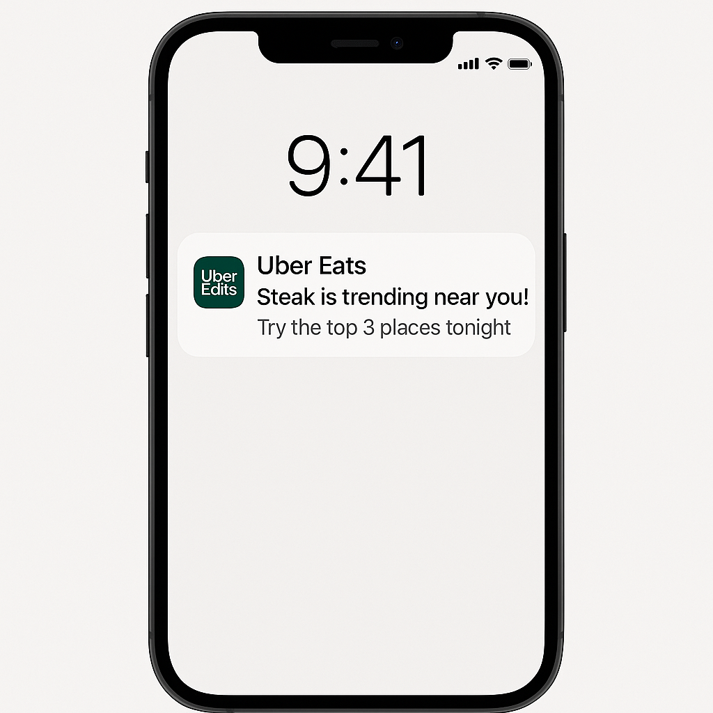
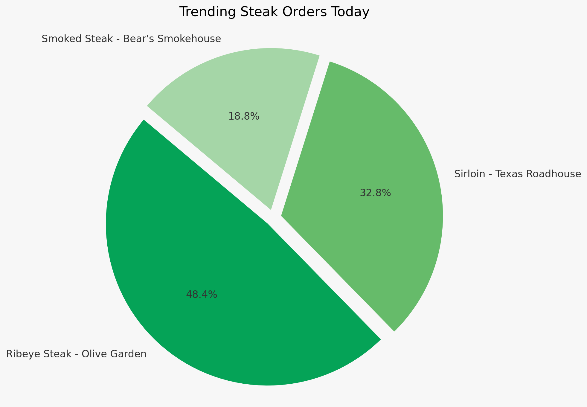
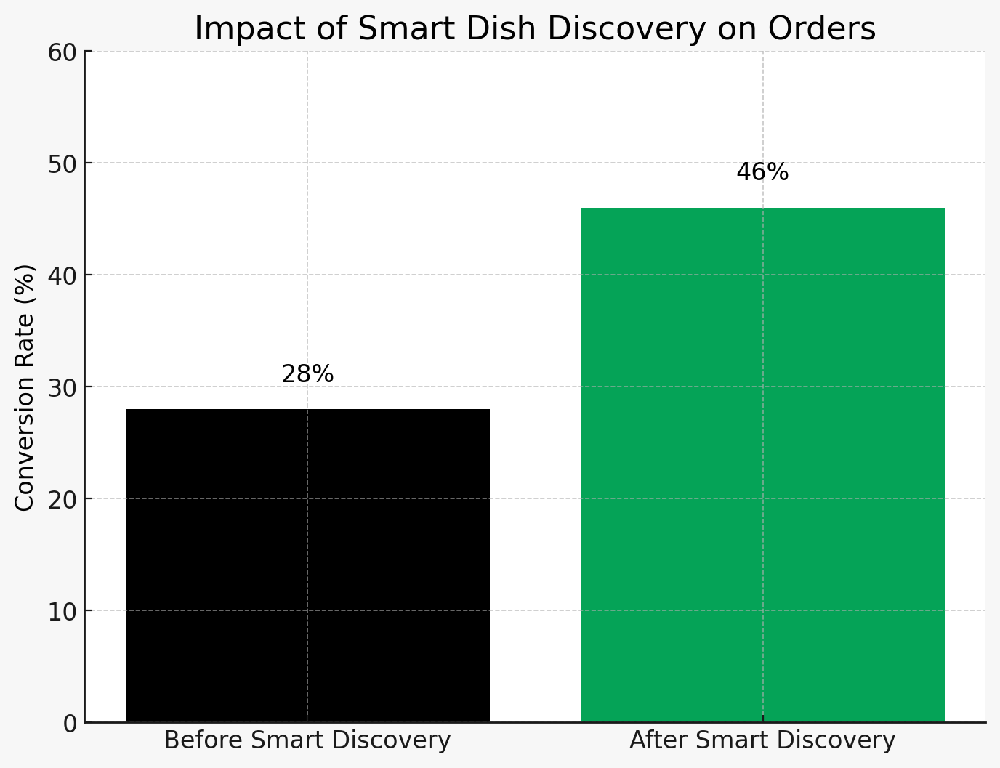

# Uber Eats Feature Launch: Smart Dish Discovery

---

## 🚀 Overview
Picking what to eat can be overwhelming. Even after searching for something like "steak" or "ramen," users are flooded with choices, making it hard to find the best options.

This project introduces **Smart Dish Discovery** — an AI-powered Uber Eats feature that shows users the most loved, most ordered dishes trending near them based on real-time data.

The goal: **help users decide faster, discover better, and trust their choices.**

---

## 🔥 Problem
- Too many choices lead to decision fatigue.
- No clear way to see trending dishes based on live data.
- Users default to fast food and miss out on trending, high-quality local meals.

---

## 🛠️ Solution: Smart Dish Discovery
- When a user searches (e.g., "Steak"), Uber Eats ranks dishes by:
  - Real-time order counts
  - Average star ratings
  - Delivery speed
  - Personal taste preferences (learned over time)
- Trending dishes are shown first, making it easy to trust and choose.

---

## 📱 User Journey

1. Open Uber Eats app.
2. Tap search bar, type a dish like "Steak."
3. See a dynamic list of trending steaks nearby.
4. Tap a trending dish to view the detail page.
5. Order confidently knowing it’s a top trending item!

---

## 🖼️ Mockups

### 🔎 Search Screen

---

### 📄 Dish Detail Page

---

### 🔔 Push Notification (Example)

---

## 🤖 AI and Technology Behind It

| Layer | Description |
|:---|:---|
| NLP Engine | Understands casual text queries |
| Dish Matching Engine | Maps keywords to menu items |
| Trend Detection Service | Tracks live order volumes |
| Personalization Layer | Learns user's food preferences |
| Ranking & Sorting Engine | Combines trends, ratings, preferences |

---

## 📊 Charts

### 📈 Trending Orders Distribution

---

### 📊 Search-to-Order Conversion Rate Improvement

---

## 🛠️ System Architecture

---

## 🚀 MVP Launch Plan

| Phase | Detail |
|:---|:---|
| Alpha | Pilot in Hartford, CT |
| Beta | Expand to 5 major U.S. cities |
| Full Rollout | National after KPIs are met |

---

## 🎯 Success Metrics

| Metric | Goal |
|:---|:---|
| Reduce browse time | -20% |
| Boost conversion from search | From 28% → 46% |
| Increase orders from local restaurants | +15% |
| Improve search experience NPS | +10 points |

---

## 💬 Final Thoughts
Smart Dish Discovery transforms Uber Eats from a food delivery app into a **trusted foodie guide** — showing users exactly what's trending, popular, and loved right now.

It helps users order faster, feel better about their choices, and discover amazing meals nearby.

---

